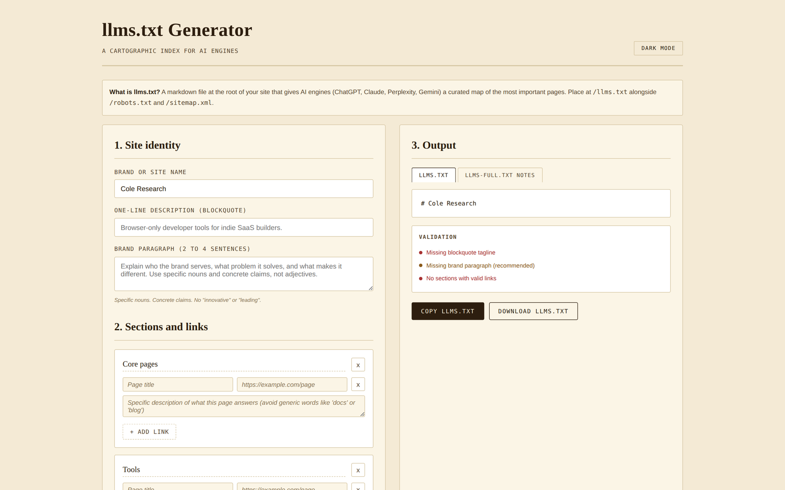

# llms-txt-generator

Generate a spec-compliant `llms.txt` for your site. Browser-only, no signup, no API calls.

**Live demo:** https://0xelitesystem.github.io/llms-txt-generator/

## What is llms.txt

A markdown file at the root of your site (`/llms.txt`) that gives AI engines a curated map of the most important pages. ChatGPT, Claude, Perplexity, and Gemini look for it when deciding what to cite. Separate from `sitemap.xml`, which lists every page; `llms.txt` is your editorial selection of what AI should index first.

## Use it

Open `index.html` in any browser. Or visit the hosted version at `https://0xelitesystem.github.io/llms-txt-generator/`.

1. Enter your brand name, one-line tagline, and a 2 to 4 sentence brand paragraph.
2. Add sections (Core pages, Tools, Reference, Pricing, etc).
3. Add links per section with specific descriptions of what each page answers.
4. Copy or download the generated file.
5. Upload to your web root so it serves at `https://yoursite.com/llms.txt`.

## What it checks for

- Site name (H1) present
- Blockquote tagline present and under 140 characters
- Brand paragraph length (2 to 6 sentences)
- At least one section with valid links
- Every link is an absolute https URL
- Every link has a specific description (not "Docs" or "Blog")
- Descriptions are 20 characters or more

The validation panel updates live as you type.

## Why descriptions matter

AI engines extract the link description verbatim when summarizing your site. A description like "Docs" gives the AI nothing to work with. "Step-by-step walkthrough of the BYOK setup, from API key creation to first successful call" gives the AI a specific citation hook.

## llms-full.txt companion

The second tab generates build notes for `llms-full.txt`, an optional companion file that concatenates the full markdown of every page listed in `llms.txt` into one file. Some AI engines fetch only one file per site; `llms-full.txt` gives them the whole brand context in a single request.

## What's not included

- No localStorage. Refreshing the page clears your work. Copy or download before closing.
- No analytics, no tracking, no third-party scripts.
- No backend. Everything runs in your browser.

## Pairs with

- [robots-txt-ai-builder](https://github.com/0xelitesystem/robots-txt-ai-builder): generate the robots.txt that points AI bots to your llms.txt
- [schema-markup-generator](https://github.com/0xelitesystem/schema-markup-generator): JSON-LD schema for the pages you list
- [ai-citability-scorer](https://github.com/0xelitesystem/ai-citability-scorer): score individual pages for AI citation likelihood
- [e-e-a-t-auditor](https://github.com/0xelitesystem/e-e-a-t-auditor): audit any page for E-E-A-T signals

## License

MIT. Free to use, fork, modify, and ship.
